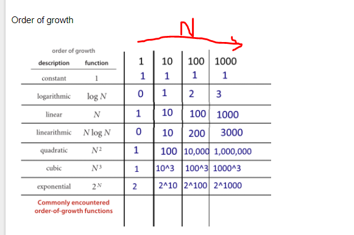

#{$page.description}

<article id="1">

## Big O Notation

[](https://postimg.org/image/x3n81brp5/)

[](https://postimg.org/image/hjfuashkp/)

- [Big O Cheatsheet](http://bigocheatsheet.com/)

> Big O sucks away the unimportant stuff so you can focus on what matters as it relates to algo performance with large inputs

- We are interested in orders of magnitude
  - So we only care if the difference is pretty large!



### O(1)

- When you have no loops and are just doing something and exiting/returning

### O(n)

- When you are doing the same amount of work that is going into a function

### O(n^2)

- Trick here is to look for double `for` or `while` loops

### O(log n)

- Where code employs **divide and conquer** strategies that use _recursion_ like merge and quick sorts
- Basically if you multiply input size by 10, the time will only increase by 1

</article>

<article id="2">

## Bubble Sort


> `bigO = n ^ 2`

- **iterative**
- Called bubble sort because it looks like it is bubbling
- it's n^2 because your for loop is n iterations and your do while loop is n iterations (n \* n)
- You probably will never use a do loop or bubble sort in production code

### Pseudocode

- double loop over array input
- if index is greater than next index swap items in place & continue
- exit early if no swap occurred within the second loop

### Implementation

<p data-height="300" data-theme-id="31719" data-slug-hash="roMaKZ" data-default-tab="js,result" data-user="RyanGarant" data-pen-title="Visualized Algo: Bubble Sort Exercise" class="codepen">See the Pen <a href="https://codepen.io/RyanGarant/pen/roMaKZ/">Visualized Algo: Bubble Sort Exercise</a> by Ryan Garant (<a href="https://codepen.io/RyanGarant">@RyanGarant</a>) on <a href="https://codepen.io">CodePen</a>.</p>

</article>

<article id="3">

## Insertion Sort


`bigO = n ^ 2`

- **iterative**
- called insertion because you are inserting in place
- Has more favorable coefficients than bubble sort
- Better for things that are **near sorted**
- merge sort and quick sort are pretty much faster in all other cases

### Pseudocode

- setup a double loop

- 2nd loop will run while it is less than the first loop's index
- if loop 1 index is less than 2nd loop's index then
  - pull loop 1 index out in place
  - insert loop 1 index before loop 2 index in place

### Implementation

<p data-height="300" data-theme-id="31719" data-slug-hash="XojJEP" data-default-tab="js,result" data-user="RyanGarant" data-pen-title="Visualized Algo: Insertion Sort" class="codepen">See the Pen <a href="https://codepen.io/RyanGarant/pen/XojJEP/">Visualized Algo: Insertion Sort</a> by Ryan Garant (<a href="https://codepen.io/RyanGarant">@RyanGarant</a>) on <a href="https://codepen.io">CodePen</a>.</p>

</article>

<article id="4">

## Recursion

> Your **base case** is the most important piece. If you don't write this first you will stack overflow

### Recipe for recursion:

1.  Identify base case(s)
2.  Identify recursive case(s)
3.  return where appropriate
4.  write procecdures for each case that bring you closer to the base case(s)

```javascript
function basicRecursion(max, current) {
  if (current > max) return
  console.log(current)
  basicRecursion(max, current + 1)
}

basicRecursion(1, 10)
```

### Fibonacci Sequences

`1, 1, 2, 3, 5, 10`

- Fibonacci sequences lends itself well to recursion because they are themselves defined **recursively**
  - You need to know the **first two preceeding** terms to get the nth number of the sequence

```javascript
function fibonacci(n) {
  if (n <= 2) return 1

  return fibonacci(n - 1) + fibonacci(n - 2)
}
```

- Notice how we are returning the recursive function
  _ It is a common mistake to not return the recursive function
  _ What will happen is it will return `undefined` instead of preserving the value you are seeking

### Factorials

`!4 = 4 * 3 * 2 * 1`

- Factorials are defined recursively by **multiplying itself** by the previous number until you get to 1

```javascript
function factorial(n) {
  if (n < 2) return 1

  return n * factorial(n - 1)
}
```

</article>

<article id="5">

## Merge Sort


`bigO = O(n log n)`

- **Recursive** algo that is very **stable**, consistent & dependable
  - However when sorting numbers stability doesn't matter because you don't care what order two 4's for instance are given to you
- Most often the sorting algo you will use

### Pseudocode

- stitch function
- mergeSort function
  - base case is if size of arr is one
  - return a recursively call passing in left & right half to stitch function

### Implementation

<p data-height="300" data-theme-id="31719" data-slug-hash="ZVpYdq" data-default-tab="js,result" data-user="RyanGarant" data-pen-title="Visualized Algo: Merge Sort" class="codepen">See the Pen <a href="https://codepen.io/RyanGarant/pen/ZVpYdq/">Visualized Algo: Merge Sort</a> by Ryan Garant (<a href="https://codepen.io/RyanGarant">@RyanGarant</a>) on <a href="https://codepen.io">CodePen</a>.</p>

</article>
